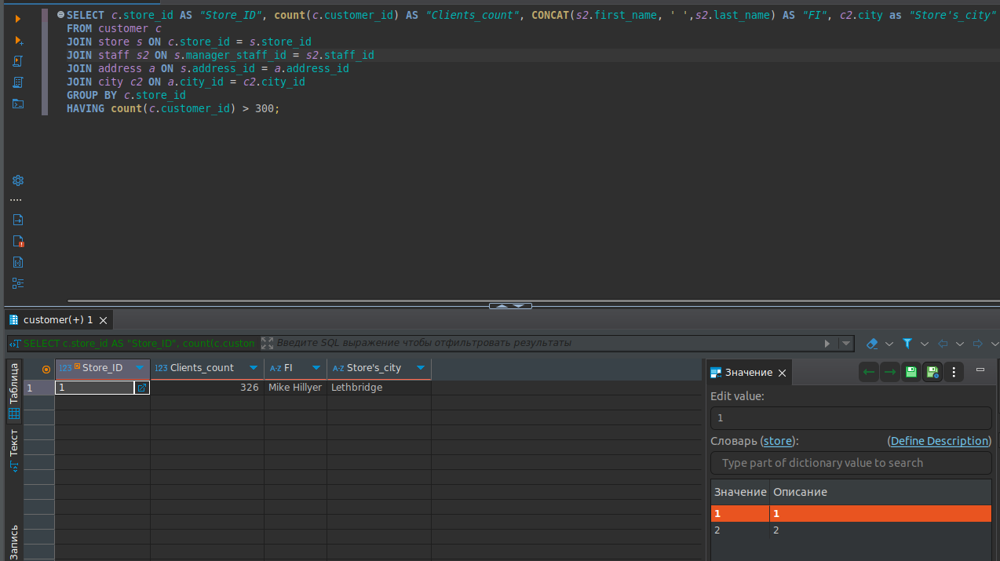
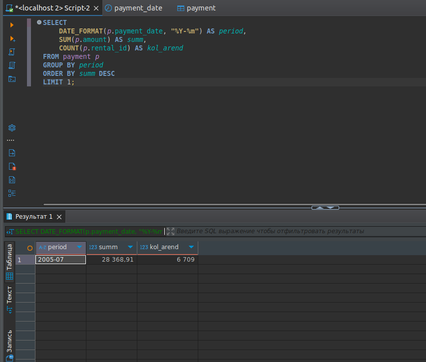

# Домашнее задание к занятию «SQL. Часть 2»

### Задание 1

Одним запросом получите информацию о магазине, в котором обслуживается более 300 покупателей, и выведите в результат следующую информацию: 
- фамилия и имя сотрудника из этого магазина;
- город нахождения магазина;
- количество пользователей, закреплённых в этом магазине.

### Решение:

```sql
SELECT c.store_id AS "Store_ID", count(c.customer_id) AS "Clients_count", CONCAT(s2.first_name, ' ',s2.last_name) AS "FI", c2.city as "Store's_city"  
FROM customer c  
JOIN store s ON c.store_id = s.store_id   
JOIN staff s2 ON s.manager_staff_id = s2.staff_id   
JOIN address a ON s.address_id = a.address_id   
JOIN city c2 ON a.city_id = c2.city_id  
GROUP BY c.store_id  
HAVING count(c.customer_id) > 300;
```


### Задание 2

Получите количество фильмов, продолжительность которых больше средней продолжительности всех фильмов.

### Решение:
```sql
SELECT count(f.film_id)
from film f 
where f.`length` > (select avg(f2.`length`) from film f2);
```


### Задание 3

Получите информацию, за какой месяц была получена наибольшая сумма платежей, и добавьте информацию по количеству аренд за этот месяц.

### Решение:
```sql
SELECT 
    DATE_FORMAT(p.payment_date, "%Y-%m") AS period, 
    SUM(p.amount) AS summ, 
    COUNT(p.rental_id) AS kol_arend
FROM payment p 
GROUP BY period
ORDER BY summ DESC 
LIMIT 1;
```

